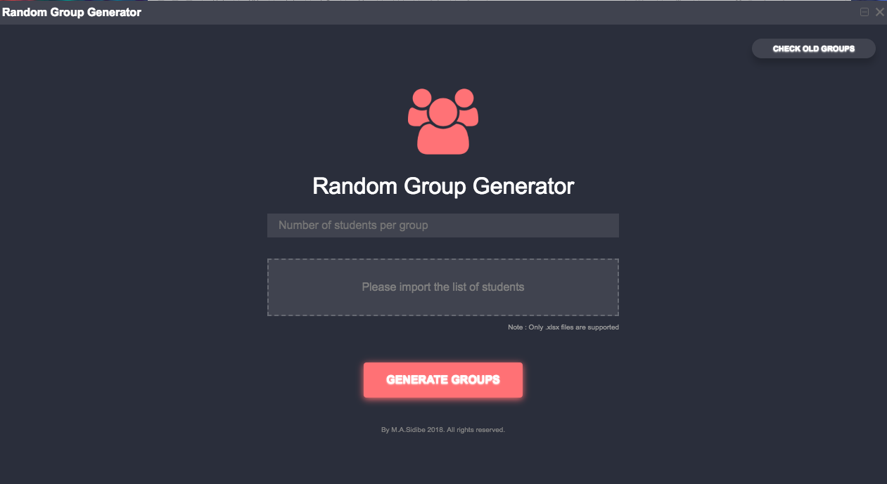
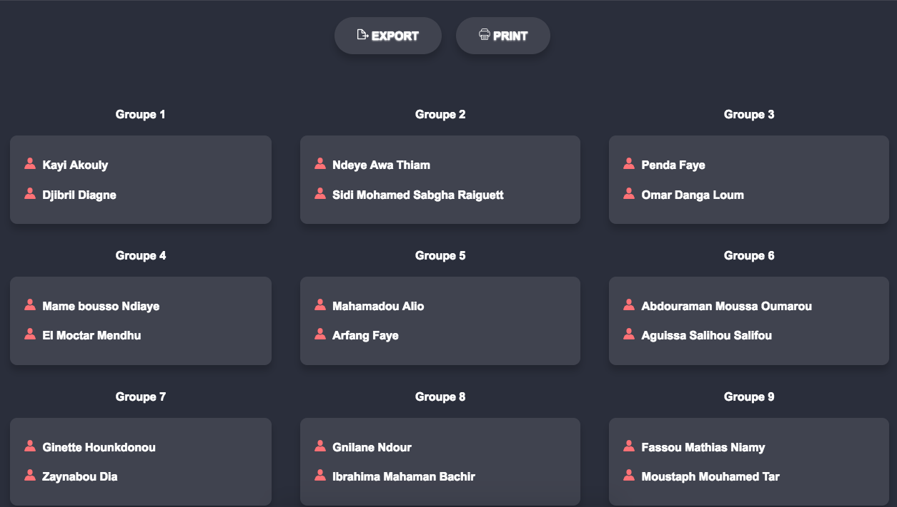
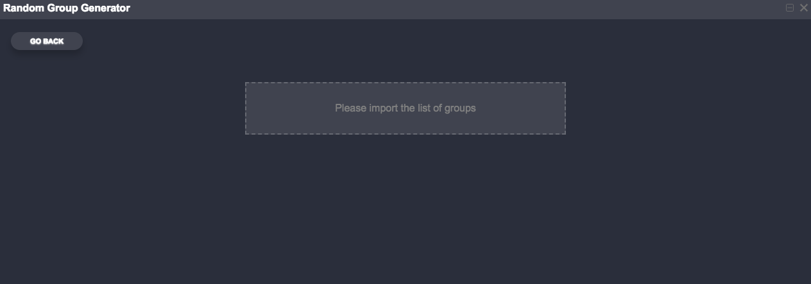
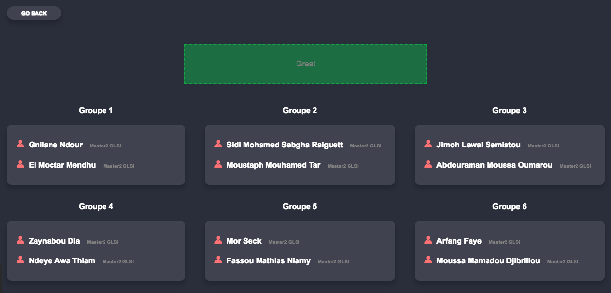

# Random Group Generator
Random Group generator is a desktop app made withe electron and angular that allows teachers to generate random group of students.
## How it works

- give the number of students per group
- Import the list of the class(we onky support .xsls files at the moment.
- Click to the generate groups button.
  
  
- You can export it (.xsl) or print it(.pdf)
- Check old groups : import the list of the groups and visualize.

  
  
  and then
  
   
  

